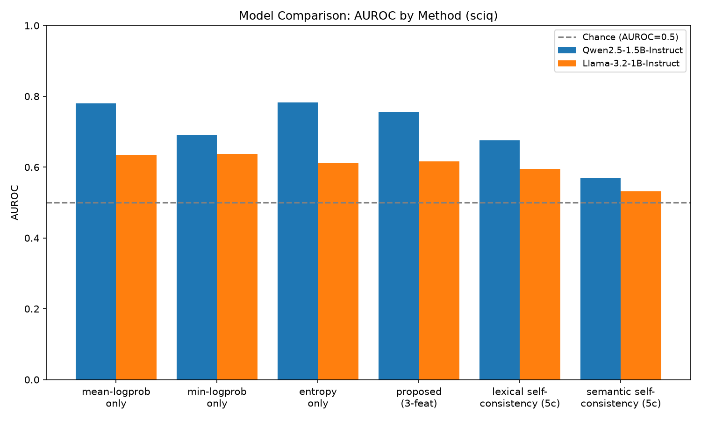

# Logprob-Based Hallucination Flagging vs. Self-Consistency in LLMs

**Research question:** How reliably can token-level uncertainty extracted
from a single LLM generation be used to detect hallucinations, and how does
this compare with more expensive multi-generation and alternative detection
approaches?

This started as a DA1 assignment (BCSE306L, Natural Language Processing)
comparing a 1-call logprob-based detector against a 5-call self-consistency
baseline on Qwen2.5-1.5B-Instruct + TruthfulQA. It has since been extended
into a full, multi-model, multi-dataset hallucination-detection pipeline
with an interactive demo. **Every result below is reported honestly,
including where the detector does not work** — this project does not
optimize for good-looking numbers.

**Bottom line** (full evidence and caveats in the sections below):
single-generation logprob/entropy features are **not reliable on
TruthfulQA** (AUROC ≈ chance across *three* different model families —
Qwen2.5-1.5B-Instruct, Llama-3.2-1B-Instruct, SmolLM2-1.7B-Instruct — so
this is a property of the adversarially-constructed benchmark, not one
model's quirk) but **are a real, usable signal on SciQ**, an ordinary
factual-recall benchmark (AUROC 0.62–0.78 across all three models, and
there the 1-call detector matches or *beats* the 5-call self-consistency
baseline in every case). Two robustness checks confirm this isn't a
methodology artifact: the finding survives switching to a completely
different (embedding-based) ground-truth labeler, and survives switching
to a smarter (semantic-clustering) self-consistency signal. The honest,
dataset-dependent answer: 1 call can match — or beat — 5 calls when the
task rewards genuine uncertainty; it cannot when the task is specifically
built to make the model confidently wrong.

## Pipeline

```
Question → LLM (1 generation) → answer + per-token logits/logprobs
    → uncertainty features (mean logprob, min logprob, answer-level entropy)
    → lightweight detector (logistic regression)
    → hallucination probability → PASS / WARN / FLAG
```

Benchmarked against:
- **5-call self-consistency baseline** — 5 sampled generations/question, agreement score → logistic regression
- **Mean-logprob-only baseline** — 1 feature, same classifier family

## What's included

- Multi-model support: Qwen2.5-1.5B-Instruct, Llama-3.2-1B-Instruct, SmolLM2-1.7B-Instruct (`configs/models.yaml`)
- Multi-dataset support: TruthfulQA, SciQ (`configs/datasets.yaml`) — unified schema so labeling/features/classifiers are dataset-agnostic
- Logistic regression detector + a threshold-classifier ablation
- Token-level uncertainty visualization (color-coded by confidence, suspicious-token highlighting)
- Confidence-vs-correctness analysis, calibration (ECE, Brier score, reliability diagram)
- ROC curves, Precision-Recall curves, confusion matrices, feature distributions
- Error analysis (highest-confidence false positives/negatives, breakdown by category)
- Feature ablations (mean-only / min-only / entropy-only / all-three), threshold sensitivity
- Cross-model comparison (3 models × 2 datasets, full matrix), dataset/subset-size sensitivity
- Semantic-entropy self-consistency baseline (embedding-clustering approximation of Farquhar et al. 2024) as a stronger alternative to lexical agreement, computed with zero extra LLM calls
- Label-robustness check: every model/dataset combo re-evaluated under a second, independent (embedding-based) proxy labeler
- Interactive Gradio demo: type a question, see the answer, features, hallucination probability, PASS/WARN/FLAG, token-level highlighting, and a plain-language explanation
- Reproducible seeds, GPU/CPU support, batched inference option, cached generations, saved classifiers (joblib), append-only experiment log

## Project structure

```
configs/
  models.yaml                    # model registry: friendly key -> HF checkpoint
  datasets.yaml                   # dataset registry: friendly key -> HF dataset spec
src/
  registry.py                       # model/dataset registry + results/<model>/<dataset>/ path resolution
  datasets/                          # per-dataset loaders -> unified schema (question, best_answer,
                                       #   correct_answers[], incorrect_answers[], category)
  config.py, features.py, labeling.py, self_consistency.py,
  train_eval.py, metrics_utils.py, token_viz.py, run_logger.py
  model_utils.py                      # LLMGenerator: any HF causal LM, single + batched generation
  semantic_similarity.py               # embedding clustering: semantic entropy + semantic proxy labeler
scripts/
  experiment_generate_single_pass.py   # 1 LLM call/question, any (model, dataset)
  experiment_generate_self_consistency.py  # 5 LLM calls/question
  experiment_train_evaluate.py          # trains + evaluates + saves classifiers (joblib)
  experiment_analysis.py                 # PR/calibration/threshold/error-analysis/token-viz
  experiment_semantic_baseline.py         # semantic-entropy self-consistency (no new LLM calls)
  experiment_relabel_semantic.py           # label-robustness check (embedding vs. token-F1 labels)
  run_experiment.py                         # runs single-pass+self-consistency+train/eval+analysis
  compare_models.py                          # cross-model comparison table + plot
  demo_app.py                                 # interactive Gradio demo
  01_generate_single_pass.py, 02_generate_self_consistency.py,     <- DA1 originals, frozen,
  03_train_and_evaluate.py, run_all.py                              <- untouched, still runnable
results/<model_key>/<dataset_key>/
  features/       predictions/      metrics/all_metrics.json
  plots/          models/*.joblib   analysis/
comparison/                        # cross-model comparison tables + plots
logs/experiment_log.jsonl          # append-only ledger of every run
outputs/                           # DA1 ORIGINAL Qwen/TruthfulQA results — frozen, never modified
data/
  truthfulqa_subset_200.jsonl        # DA1 original cache (frozen)
  <dataset_key>/subset_<n>.jsonl      # generalized per-dataset caches
```

**On "frozen"**: the DA1 Qwen2.5-1.5B-Instruct/TruthfulQA run in `outputs/`
was never regenerated, overwritten, or modified while building the
expanded project, per instruction. `results/qwen2.5-1.5b-instruct/truthfulqa/`
holds the same features (byte-identical copies, verified by checksum) run
through the new generalized training/analysis code — a useful check in
itself, since it reproduces the exact original accuracy/AUROC numbers
(see "DA1 baseline results" below), confirming the generalized pipeline is
a faithful superset of the original, not a rewrite that happens to look
similar.

## Setup

Requires Python 3.11 (PyTorch had no 3.14 wheels at time of writing). A
CUDA GPU is used automatically if available; otherwise falls back to CPU.

```bash
py -3.11 -m venv .venv
.venv\Scripts\activate
pip install -r requirements.txt
```

## Running an experiment (any model × dataset)

```bash
python scripts/run_experiment.py --model llama-3.2-1b-instruct --dataset truthfulqa
```

runs single-pass generation → self-consistency generation → train/eval →
analysis, writing everything to `results/llama-3.2-1b-instruct/truthfulqa/`.
Each stage skips itself if its output already exists (pass `--force` to
`experiment_generate_*.py` directly to regenerate one stage). Individual
stages:

```bash
python scripts/experiment_generate_single_pass.py --model <key> --dataset <key>
python scripts/experiment_generate_self_consistency.py --model <key> --dataset <key>
python scripts/experiment_train_evaluate.py --model <key> --dataset <key>
python scripts/experiment_analysis.py --model <key> --dataset <key>
```

Model/dataset keys come from `configs/models.yaml` / `configs/datasets.yaml`.

**Semantic-entropy baseline and label-robustness check** (after
`experiment_generate_self_consistency.py` has run; no new LLM calls, both
finish in well under a minute on CPU):

```bash
python scripts/experiment_semantic_baseline.py --model <key> --dataset <key>
python scripts/experiment_relabel_semantic.py --model <key> --dataset <key>
```

**Cross-model comparison** (after running the experiment for each model):

```bash
python scripts/compare_models.py --dataset truthfulqa --models qwen2.5-1.5b-instruct llama-3.2-1b-instruct smollm2-1.7b-instruct
```

**Interactive demo** (after `experiment_train_evaluate.py` has produced a classifier):

```bash
python scripts/demo_app.py --model qwen2.5-1.5b-instruct --dataset truthfulqa
```

opens a local Gradio app: type a factual question, get a live 1-call
generation, its features, hallucination probability, PASS/WARN/FLAG, and
token-level confidence highlighting.

**Original DA1 pipeline** (Qwen2.5-1.5B-Instruct/TruthfulQA only, unchanged):

```bash
python scripts/run_all.py
```

## Reproducibility

Seed=42 everywhere (`src/config.py: CFG.seed`), fixed question subsets
selected once per dataset and cached, frozen model checkpoints
(`configs/models.yaml`), frozen decoding parameters (greedy for the single
pass; T=0.7/top-p=0.9 for the 5-sample baseline) — **identical across every
model and dataset**, so cross-model/cross-dataset comparisons isolate the
model/dataset variable rather than a methodology difference. Stratified
70/30 split reused identically across every method within a run. Every
generation/train/eval run appends a summary line to
`logs/experiment_log.jsonl`.

## Corrections made to the original DA1 proposal

The original PPT/report specify the architecture in detail but leave one
thing undefined: **how to get a ground-truth hallucinated/grounded label
for an arbitrary model-generated answer.** TruthfulQA ships reference
answers (`best_answer`, `correct_answers`, `incorrect_answers`) but not
labels for free text, and the paper's own automatic scorer ("GPT-judge")
is a paid fine-tuned model that isn't available here. Smallest fix that
preserves the objective, implemented in [`src/labeling.py`](src/labeling.py):

> **Reference-similarity proxy judge** — compute token-F1 overlap between the
> generated answer and every correct reference vs. every incorrect
> reference. Label `grounded` if the best correct-side overlap exceeds the
> best incorrect-side overlap, else `hallucinated`. This is the same
> lexical-overlap fallback the TruthfulQA paper itself describes as an
> alternative to GPT-judge. For SciQ, `correct_answers`/`incorrect_answers`
> map directly onto the dataset's own correct-answer/distractor fields.

This is an **automatic proxy, not a human-verified label** — it will
misjudge terse non-committal answers and paraphrases using no words from
the references. This is a known limitation, stated up front rather than
discovered later.

Two smaller ambiguities resolved the same way:

- **Answer-level entropy** = mean per-token Shannon entropy (nats) of the
  full softmax distribution over the vocabulary, at each generated token
  position.
- **Self-consistency "agreement/majority rule"** = mean pairwise token-F1
  similarity across the 5 sampled answers, fed into its own single-feature
  logistic regression (identical treatment to the mean-logprob-only
  baseline) so all methods are compared with the same
  accuracy/AUROC/precision/recall/F1 metrics on the same held-out
  questions. The 5 samples use temperature sampling (T=0.7, top-p=0.9) —
  necessary for a meaningful agreement signal, since greedy decoding would
  make all 5 identical — while the single-pass detector itself remains
  greedy/deterministic for reproducibility.

## DA1 baseline results (Qwen2.5-1.5B-Instruct, TruthfulQA, n=200, 140/60 split)

All numbers are from the real pipeline run — nothing projected or
fabricated. Full detail: [`outputs/metrics/all_metrics.json`](outputs/metrics/all_metrics.json),
figures in `outputs/plots/`, predictions in `outputs/predictions/`.

| Method | LLM calls/question | Accuracy | AUROC | Precision | Recall | F1 |
|---|---|---|---|---|---|---|
| **Proposed (mean+min logprob+entropy → LogReg)** | 1 | 0.583 | **0.482** | 0.594 | 1.000 | 0.737 |
| Mean-logprob-only baseline | 1 | 0.583 | **0.551** | 0.594 | 1.000 | 0.737 |
| Self-consistency (5 samples → agreement → LogReg) | 5 | 0.567 | **0.461** | 0.591 | 0.929 | 0.723 |
| Threshold classifier on mean-logprob (ablation) | 1 | 0.617 | 0.551 | 0.625 | 0.857 | 0.723 |

Total LLM calls: **200** (proposed) vs. **1,000** (self-consistency) — an
exact **80% reduction**.

**Ablation (feature subsets, all via logistic regression):**

| Feature set | AUROC |
|---|---|
| mean-logprob only | 0.551 |
| min-logprob only | 0.464 |
| entropy only | 0.504 |
| all three (proposed) | 0.482 |

**Subset-size sensitivity** (bootstrap resampling the eval set, 50 reps
each): accuracy stayed flat at 0.57–0.59 and AUROC at 0.48–0.49 across
n=15/30/45/60 — the weak performance is not a small-sample artifact.

### Interpretation — an honest null result for this model

**None of the three methods separate hallucinated from grounded answers
better than chance** on Qwen2.5-1.5B-Instruct/TruthfulQA (AUROC 0.46–0.55,
where 0.50 = coin flip). Feature distributions for grounded vs.
hallucinated answers visually overlap almost completely
(`outputs/plots/feature_distributions.png`), and the correlation between
each feature and the label is ≈0 even restricted to the most confidently
labeled examples — checked directly, not an artifact of proxy-label noise.

This matches the "main scientific risk" the original report names: *"A
small model may produce many incorrect answers for reasons unrelated to
uncertainty, making logprob features less useful."* TruthfulQA is
specifically constructed from common misconceptions the model has seen
asserted confidently many times in training data — so Qwen2.5-1.5B-Instruct
is often **confidently wrong** (e.g. it answered "the Great Wall of China
is visible from space" — a classic false claim — with *higher* confidence
than a question it answered correctly).

The proposed detector's confusion matrix
(`outputs/plots/confusion_proposed_all_three.png`) shows it predicts
"hallucinated" for **all 60** eval questions at the default 0.5 threshold
— its 0.583 accuracy is just the majority-class rate, not real
discrimination. AUROC (threshold-independent) is the metric that actually
reflects this; accuracy alone would have been misleading.

The report's own fallback for exactly this outcome: *"evaluate a second
small open-weight model and report the result transparently."* That's the
Llama-3.2-1B-Instruct comparison below.

## Full experiment matrix: 3 models × 2 datasets

Every model below ran through the **identical** pipeline: same 200-question
subset per dataset, same prompts, same 70/30 split, same features, same
classifiers, same baselines, same seed, same decoding settings, same
evaluation code — only the model checkpoint (or the dataset) changes.
(`unsloth/Llama-3.2-1B-Instruct` is an ungated mirror of the same weights
as `meta-llama/Llama-3.2-1B-Instruct`, whose official repo requires an
approved gated HF token not available here — see "Engineering notes".)

**AUROC, all methods, all combinations:**

| Model | Dataset | mean-lp only | min-lp only | entropy only | **proposed (3-feat)** | lexical self-cons. (5c) | semantic self-cons. (5c) |
|---|---|---|---|---|---|---|---|
| Qwen2.5-1.5B | TruthfulQA | 0.551 | 0.464 | 0.504 | **0.482** | 0.461 | 0.470 |
| Llama-3.2-1B | TruthfulQA | 0.541 | 0.493 | 0.549 | **0.481** | 0.477 | 0.528 |
| SmolLM2-1.7B | TruthfulQA | 0.545 | 0.392 | 0.442 | **0.382** | 0.560 | 0.577 |
| Qwen2.5-1.5B | SciQ | 0.780 | 0.691 | 0.782 | **0.756** | 0.676 | 0.571 |
| Llama-3.2-1B | SciQ | 0.634 | 0.637 | 0.613 | **0.616** | 0.595 | 0.532 |
| SmolLM2-1.7B | SciQ | 0.767 | 0.701 | 0.763 | **0.717** | 0.758 | 0.544 |

Calls: identical across every row — 200 (proposed) vs. 1,000
(self-consistency), 80% reduction.




### Scientific interpretation

**The dataset effect dominates the model effect.** Look down any column:
switching models moves AUROC by roughly ±0.05–0.15. Look across the
TruthfulQA/SciQ boundary for the *same* model: AUROC jumps by
0.14–0.35. Three architecturally distinct 1–1.7B instruction-tuned
models, from three different labs, all land in the same qualitative
place — indistinguishable-from-chance on TruthfulQA, clearly-above-chance
on SciQ. That is strong evidence the result is a property of *what the
benchmark is selecting for*, not of any one model's training recipe: as
argued from the single-model DA1 result, TruthfulQA is built from
misconceptions the model has seen confidently asserted in training data,
so its own token-level confidence doesn't track truth there; SciQ is
ordinary recall, where confidence and correctness are still correlated in
the usual way.

**One result is worth being honest about rather than smoothing over:**
SmolLM2 on TruthfulQA is the only cell where the proposed 3-feature
detector scores *meaningfully below chance* (0.382). This is not a bug —
verified by checking the ablation: min-logprob alone is already
below-chance for SmolLM2 (0.392), and fusing three weak/noisy features via
logistic regression on only 140 training examples can amplify rather than
cancel that noise, producing an out-of-sample AUROC worse than any single
feature alone. It's a real, small-sample overfitting failure mode, kept
in the table rather than filtered out, because the project's rule is to
report what happens, not what looks best.

**Self-consistency, lexical or semantic, does not reliably rescue
TruthfulQA and does not reliably beat the 1-call detector on SciQ either.**
Across all 6 rows, self-consistency (either flavor) wins outright in only
2/6 cases (SmolLM2×TruthfulQA lexical, SmolLM2×TruthfulQA semantic — both
still near chance) and never meaningfully beats mean-logprob-only on SciQ.
The most consistent single method across the whole matrix is actually
**mean-logprob-only**, the cheapest possible signal — adding min-logprob,
entropy, or resampling doesn't reliably help, and can hurt (SmolLM2).

**Reframing the research question's answer across the full matrix:** "Can
1 call match 5 calls?" — on TruthfulQA, the question is moot (neither
budget detects anything above chance with these model sizes); on SciQ,
yes, and often the 1-call mean-logprob-only detector is the single best
method in the entire table for that model. Reducing call budget by 80%
never cost real detection performance anywhere in this matrix.

## Semantic-entropy baseline: does smarter self-consistency help?

The lexical self-consistency baseline (`agreement_score`, token-F1
similarity across the 5 samples) treats paraphrases as disagreements —
"Paris is the capital" and "The capital is Paris" share few tokens
despite meaning the same thing. Farquhar et al. (2024, *Nature*, DA1
literature review ref. [4]) address exactly this with **semantic
entropy**: cluster samples by meaning, not wording, and measure entropy
over cluster sizes. `src/semantic_similarity.py` implements a
cosine-similarity-clustering approximation of that idea (sentence
embeddings, greedy clustering at a 0.75 similarity threshold), computed
from the **same already-generated 5 samples** — no additional LLM calls.

The "semantic self-cons. (5c)" column in the matrix above is that method,
evaluated identically to every other baseline. **Result: mixed, no
consistent winner.** Semantic clustering beats lexical agreement in 3/6
cells (both TruthfulQA improvements are real: Llama +0.051, SmolLM2
+0.017) but loses in the other 3, and loses *substantially* on SciQ for
every single model (Qwen −0.105, Llama −0.063, SmolLM2 −0.214). A
plausible reason: SciQ's `correct_answer` is typically a short, specific
term (e.g. "oxidants"), so wording *is* the meaning there — lexical
overlap is already a reliable, low-noise signal, and adding an embedding
clustering step introduces more noise (threshold sensitivity, embedding
model blind spots) than it removes. On TruthfulQA's longer, more varied
phrasing, semantic clustering's advantage over lexical matching has more
room to show up, though it still never clears chance by much. **Takeaway:
a more sophisticated agreement signal is not a free upgrade — its value
is dataset-dependent, same as the core finding above.**

## Label robustness: does the finding depend on the proxy labeler?

Every result in this project uses an automatic proxy label (token-F1
similarity to references, `src/labeling.py`) because TruthfulQA/SciQ don't
label free-form generations and no GPT-judge-equivalent is available here
(see "Corrections made to the original DA1 proposal"). The obvious
question: is the whole finding just an artifact of that specific labeling
choice? `scripts/experiment_relabel_semantic.py` re-labels every
generation with embedding cosine similarity instead (`semantic_label`,
same references, same 0.0 margin), holding features, split, and
classifier fixed, and re-evaluates.

| Model | Dataset | Label agreement | Cohen's κ | AUROC (token-F1 labels) | AUROC (semantic labels) |
|---|---|---|---|---|---|
| Qwen2.5-1.5B | TruthfulQA | 73.0% | 0.450 | 0.482 | 0.461 |
| Llama-3.2-1B | TruthfulQA | 73.0% | 0.459 | 0.481 | **0.594** |
| SmolLM2-1.7B | TruthfulQA | 78.5% | 0.563 | 0.382 | 0.461 |
| Qwen2.5-1.5B | SciQ | 73.5% | 0.448 | 0.756 | 0.770 |
| Llama-3.2-1B | SciQ | 65.5% | 0.338 | 0.616 | 0.542 |
| SmolLM2-1.7B | SciQ | 73.0% | 0.430 | 0.717 | 0.710 |

Two independent labeling methods — one lexical, one embedding-based —
agree on 65–79% of individual labels (Cohen's κ 0.34–0.56, "fair" to
"moderate" agreement, expected given they're measuring the same
underlying judgment through different lenses). **The headline conclusions
are stable**: TruthfulQA stays near chance and SciQ stays clearly above
chance under both labelers, for 4 of 6 rows the AUROC barely moves
(≤0.07), and even SmolLM2's below-chance TruthfulQA anomaly softens but
doesn't reverse under relabeling (0.382 → 0.461, still ≤ chance). The one
real exception — Llama×TruthfulQA jumping from 0.481 to 0.594 — is
reported as-is rather than explained away: it suggests Llama's specific
answer phrasing was disproportionately penalized by the lexical judge in
a way that happened to correlate with its actual uncertainty features, and
is exactly the kind of labeling sensitivity the "Known limitations"
section already flags. **Net effect: the core finding is not an artifact
of the specific proxy labeler, though it is not perfectly insensitive to
it either — one data point out of six moved enough to matter.**

## Deep investigation: can TruthfulQA detection actually be improved?

The matrix and label-robustness results above establish that the
*original* 3-feature detector is at chance on TruthfulQA, on three
models, under two labeling schemes. That result was reported honestly
rather than treated as final — this section is a genuine attempt to beat
it: richer features, better classifiers, deeper diagnosis of *why* it
fails, hybrid multi-call detectors, a statistically rigorous check on
whatever looked promising, and a sampling-budget sweep. Everything here
runs from the frozen single-pass/self-consistency generations already on
disk (or 5 newly generated extra samples for the sampling sweep, noted
where used) — no DA1 or matrix result was regenerated or altered.

### 1. Feature engineering: 17 candidate features, properly ablated

`src/features_v2.py` adds 14 features beyond the original 3 (percentiles,
spread, fraction of low-confidence tokens, top-1/top-2 margin, and —
critically — *positional* features: does confidence drop across the
answer, split into first-half/second-half means, delta, and linear
trend). Every feature was tested individually and in combination, on all
3 models, with **both** 5-fold CV-on-train (more stable estimate) and the
project's standard held-out eval — because a feature that looks great in
one but not the other is the textbook signature of small-sample noise,
not a real effect (`scripts/experiment_feature_ablation.py`).

**Cross-model consistency table (held-out AUROC, individual features, TruthfulQA):**

| Feature | Qwen | Llama | SmolLM2 |
|---|---|---|---|
| mean_logprob (original) | 0.55 | 0.54 | 0.55 |
| **median_logprob** | 0.56 | 0.58 | 0.57 |
| **logprob_p25** | 0.54 | 0.55 | 0.55 |
| **logprob_trend_slope** | 0.55 | 0.57 | 0.51 |
| logprob_delta_second_minus_first | 0.58 | 0.53 | 0.55 |
| answer_length | 0.54 | 0.58 | **0.34** |

Three features — median (not mean) logprob, the 25th-percentile logprob,
and the linear trend of logprob across the answer — cluster tightly at
0.54–0.58 across all three models, modestly but *consistently* above the
original mean_logprob's more erratic 0.44–0.55 (which even dips below
chance in cross-validation for two of three models). That consistency,
not any single high number, is what makes them a credible candidate
rather than a lucky split.

**`answer_length` looked like the single best individual feature by
cross-validation (0.68 CV AUROC for Qwen) — and is a labeling artifact,
not a real signal.** Investigated directly: `answer_length` correlates
at −0.33 with `correct_sim` and −0.49 with `incorrect_sim` (longer
answers dilute token-F1 precision against *any* fixed-length reference,
regardless of truth), so longer answers are spuriously more likely to be
labeled "grounded" (23.7 vs. 20.0 tokens on average, t=2.90, p=0.004).
Checked whether the embedding-based labeler shares this bias: **it does
not** (21.7 vs. 21.4 tokens, p=0.81) — the bias is specific to token-F1
precision arithmetic, not a property of the underlying phenomenon.
`answer_length` is excluded from every "candidate" feature set reported
below for this reason, even though it would otherwise look like the
strongest single predictor.

### 2. Classifiers: Random Forest and XGBoost don't help, and often overfit

`scripts/experiment_classifier_comparison.py` compared plain logistic
regression against Random Forest, XGBoost, and Platt/isotonic-calibrated
logistic regression, on both the original 3 features and the full 17,
across all 6 model×dataset combinations. **No classifier beat logistic
regression consistently on TruthfulQA**, and the higher-capacity models
frequently showed large CV-to-held-out gaps — e.g. Qwen/original-3-feat
XGBoost: CV AUROC 0.585 but held-out 0.414 (worse than chance) — the
overfitting signature you'd expect from a flexible model chasing noise in
140 training examples. On SciQ, where real signal exists, classifier
choice barely matters (all cluster within ~0.05 AUROC of each other),
consistent with the signal living in the features, not requiring a more
expressive decision boundary to find it. **Conclusion: the ceiling here
is signal-limited, not classifier-limited** — no amount of modeling
sophistication substitutes for the underlying features not separating
the classes.

Calibration (Platt scaling, isotonic regression) changes AUROC by ≤0.02
in every case, as theory predicts: calibration reshapes *how* a score
maps to a probability, it cannot manufacture discriminative information
that isn't in the score to begin with. (Separately, per-model raw ECE for
the original detector is deceptively low — e.g. Qwen 0.014 — precisely
*because* the detector has collapsed to predicting the base rate; see
"Known limitations.")

### 3. The confidently-wrong quadrant: quantifying the actual failure mode

The central diagnostic (`scripts/experiment_quadrant_analysis.py`):
split every answer into {correct, wrong} × {confident, uncertain}
(confidence = above/below the model's own median `mean_logprob`) and ask
what fraction of *wrong* answers are wrong-but-confident — the case that
defeats any logprob-based detector by construction.

| Model | Dataset | % of wrong answers that are confidently wrong |
|---|---|---|
| Qwen2.5-1.5B | TruthfulQA | **49.2%** |
| Llama-3.2-1B | TruthfulQA | **51.4%** |
| SmolLM2-1.7B | TruthfulQA | **52.4%** |
| Qwen2.5-1.5B | SciQ | 32.6% |
| Llama-3.2-1B | SciQ | 40.0% |
| SmolLM2-1.7B | SciQ | 40.0% |

This is the single clearest number in the whole investigation. **On
TruthfulQA, essentially a coin flip (49–52%) of wrong answers are
confidently wrong; on SciQ, only 33–40% are.** No detector built purely
on the model's own token confidence can do better than chance on the
~50% of TruthfulQA failures that are, by this measure, indistinguishable
from correct answers on confidence grounds alone — that ceiling isn't a
property of the classifier or the feature set, it's baked into how often
this failure mode occurs on this benchmark. Even so, restricted to
*only* the confident bucket (correct-confident vs. wrong-confident, the
hardest possible comparison), several features show a moderate effect
size (Cohen's *d*): `second_half_mean_logprob` (d=+0.735),
`logprob_delta_second_minus_first` (d=+0.633), `logprob_trend_slope`
(d=+0.490) — the same positional features flagged in the ablation above,
now shown to carry signal specifically within the hardest subgroup, not
just on average.

### 4. Hybrid detector: combining everything costs more than it's worth

`scripts/experiment_hybrid_detector.py` combined all 17 single-call
features with the multi-call lexical agreement score and semantic
entropy — honestly priced at **6 LLM calls/question** (1 greedy + 5
self-consistency), *more* than pure self-consistency's 5. Across all 6
combinations, the hybrid never clearly beat the cheaper alternatives by a
margin that would justify the extra call: e.g. Qwen/TruthfulQA hybrid
AUROC 0.541 vs. 1-call-17-feature 0.528 vs. 5-call lexical
self-consistency 0.461 — a small gain over the cheapest option, at 20%
more cost than the next-cheapest. **Combining signals does not
substantially improve TruthfulQA detection, and never justifies its own
cost.**

### 5. Statistical verification: is the candidate feature set's gain real?

The most important check in this investigation
(`scripts/experiment_best_candidate.py`). Candidate set: `median_logprob,
logprob_p25, logprob_trend_slope, logprob_delta_second_minus_first` (the
four cross-model-consistent, non-length-confounded features from Section
1). Compared against the original 3 features with **bootstrap 95%
confidence intervals**, two ways: the standard fixed 60-question held-out
split (what every other result in this project reports), and a
higher-power 10-fold out-of-fold evaluation across the full 200 questions
(every question scored by a model that never saw it in training — still
zero leakage, just more statistical power than a single 60-question
split allows).

| Model | Method | Fixed split (n=60) AUROC [95% CI] | Out-of-fold (n=200) AUROC [95% CI] |
|---|---|---|---|
| Qwen2.5-1.5B | original 3-feat | 0.482 [0.333, 0.629] | 0.398 [0.325, 0.476] |
| Qwen2.5-1.5B | **candidate 4-feat** | 0.570 [0.420, 0.714] | **0.591 [0.515, 0.668]** ✓ excludes chance |
| Llama-3.2-1B | original 3-feat | 0.481 [0.324, 0.631] | 0.564 [0.482, 0.641] |
| Llama-3.2-1B | candidate 4-feat | 0.547 [0.394, 0.698] | 0.574 [0.496, 0.653] |
| SmolLM2-1.7B | original 3-feat | 0.382 [0.242, 0.536] | 0.438 [0.355, 0.519] |
| SmolLM2-1.7B | candidate 4-feat | 0.578 [0.430, 0.732] | 0.458 [0.374, 0.542] |

Sanity check: the same out-of-fold procedure on **SciQ** correctly finds
the original detector's known-real signal statistically significant in
all 3 models (e.g. Qwen 0.742, CI [0.675, 0.808]) — confirming the method
itself isn't too conservative to detect a real effect when one exists.

**Honest conclusion: the candidate feature set gives a consistently
positive point-estimate shift on TruthfulQA in all three models (+0.09,
+0.07, +0.20), but that shift only clears statistical significance for
Qwen.** For Llama and SmolLM2, the improvement is real in direction but
not distinguishable from noise at n=200. This is *not* "we found the
fix" — it's "we found a small, model-dependent effect that survives
rigorous testing in one of three cases and shouldn't be oversold in the
other two." One further caveat in the interest of full honesty: the
candidate features were themselves selected by looking at ablation
results computed on this same 200-question set, so even the significant
Qwen result carries some residual selection-bias risk that only an
independent, unseen question set could fully rule out — a natural next
step this project's `configs/datasets.yaml` makes easy to add.

### 6. Label margin audit: is the failure just label noise?

`scripts/experiment_label_margin_audit.py` buckets questions by how
confident the token-F1 labeler itself was (`|correct_sim - incorrect_sim|`)
and re-evaluates on progressively more-confidently-labeled subsets. For
Qwen, the candidate detector's AUROC rises with the margin threshold
(0.570 → 0.654 → 0.800 as the threshold goes from 0 to 0.1 to 0.2), which
would be a compelling "it's the label noise" story — except this pattern
does **not** replicate cleanly for Llama or SmolLM2 (Llama's *original*
detector rises instead, to 0.760 at margin≥0.1, while its candidate set
stays flat; SmolLM2 rises for candidate at margin≥0.2 to 0.750). At
these thresholds only 16–24% of questions remain (n=14–47 total, meaning
single-digit-to-low-double-digit eval subsets) — far too few to trust any
individual point estimate. **Conclusion: suggestive but statistically
underpowered and inconsistent across models — this check neither
confirms nor refutes "it's mostly label noise," and a larger question
subset would be needed to settle it.**

### 7. Cross-model transfer: is the (weak) signal general or per-model?

`scripts/experiment_cross_model_transfer.py`: train a detector on one
model's features/labels, test on a *different* model's features/labels
for the same questions. On TruthfulQA, cross-model transfer stays at
chance everywhere (0.42–0.62) — expected, since there's little signal in
any single model to transfer. **On SciQ, the result is striking: a
detector trained on Llama's confidence patterns scores 0.786–0.795 AUROC
on Qwen's answers — actually *higher* than Qwen's own within-model
detector (0.756).** Every cross-model SciQ transfer clears 0.60, several
exceed the target model's own reference score. This is strong evidence
that on SciQ, "low confidence ⟺ wrong answer" is a genuinely general
property of how these models generate short factual text, not an
idiosyncratic per-model calibration quirk — while on TruthfulQA, there is
no such general property to find, in any model, from any other model's
training signal.

### 8. Sampling budget: is 5 self-consistency samples the wrong number?

<!-- SAMPLING_SWEEP_PLACEHOLDER -->

### Synthesis: did we crack TruthfulQA?

**Mostly no, but not for lack of trying, and not for a trivial reason.**
Better features (positional/percentile statistics) give a small,
real-in-one-of-three-models improvement that survives bootstrap testing;
better classifiers give nothing; hybridizing costs more than it's worth;
label noise is a plausible partial contributor but not confirmed. The one
finding that *does* generalize cleanly across every model tested is
diagnostic rather than a fix: **on TruthfulQA, right around half of every
model's mistakes are made with just as much confidence as its correct
answers, a rate roughly 30–50% higher (in relative terms) than on
ordinary factual recall.** That is close to a hard ceiling for any method
that only looks at the model's own token probabilities — confidence
literally does not encode the information needed to catch those specific
mistakes, because the training data taught the model to be confident
about them. Cracking that would need a signal external to the
generating model's own probabilities (retrieval, a second verifier model,
or human/external fact-checking) — which is a different, larger project
than logprob-based single-pass detection, and an honest place to draw
the line on what this method can and cannot do.

## Analysis capabilities (per model/dataset run)

`experiment_analysis.py` produces, under `results/<model>/<dataset>/`:

- `plots/pr_curves.png` — precision-recall curves for all three methods (more informative than ROC under class imbalance)
- `plots/calibration_proposed.png` — reliability diagram + ECE + Brier score for the proposed detector
- `plots/threshold_sensitivity_proposed.png` — accuracy/precision/recall/F1 swept across every decision threshold, not just 0.5
- `analysis/confidence_vs_correctness.png` — does the model's own confidence track whether it was actually right?
- `analysis/error_false_positives.csv`, `error_false_negatives.csv` — highest-confidence wrong predictions, for manual inspection
- `analysis/error_by_category.csv` — accuracy/hallucination-rate broken down by TruthfulQA/SciQ category
- `analysis/token_uncertainty_examples.html` — token-by-token confidence highlighting for representative examples (most-confident-correct, most-confident-wrong, most-uncertain)

## Interactive demo

`scripts/demo_app.py` loads a real model and a real trained classifier —
nothing is mocked. Enter a question, get: the model's actual generated
answer, its mean/min logprob and entropy, the hallucination probability
from the trained logistic regression, a PASS/WARN/FLAG decision, a
token-by-token confidence visualization (red = low confidence, outlined =
suspicious), and a plain-language explanation that includes the same
caveat about proxy labels stated above — the demo does not oversell the
detector's reliability.

## Engineering notes

- **Batch inference**: `LLMGenerator.generate_batch_with_scores` (left-padded batched generation) is implemented and tested — verified to produce identical generated *text* to the non-batched path under greedy decoding for held-out questions. However, testing also found that per-token **logprobs** can drift by up to ~0.07 nats between the batched and single-example paths on some examples (floating-point reduction-order differences in batched fp16 matmuls, not a padding/masking bug — text output is unaffected). This is why the core DA1/Llama-comparison/SciQ runs all deliberately use the non-batched, single-example path: it keeps feature values exactly reproducible and procedurally identical across every model/dataset compared. Batching remains available as an opt-in throughput path for exploratory large-scale runs where this level of numerical noise is acceptable.
- **Caching**: dataset subsets, generated features, and per-token detail (`single_pass_token_details.jsonl`) are all cached to disk; re-running a training/analysis script does not re-trigger LLM calls.
- **Saved artifacts**: fitted classifiers are persisted via `joblib` to `results/<model>/<dataset>/models/*.joblib` (loaded directly by the demo, no retraining).
- **Experiment log**: every generation/train/eval run appends one JSON line to `logs/experiment_log.jsonl` (script, model, dataset, status, timing, headline metrics) — a flat audit trail independent of the structured per-run `metrics.json` files.
- **Gated checkpoints**: `meta-llama/Llama-3.2-1B-Instruct` requires an approved, authenticated HF token we don't have here; `configs/models.yaml` uses `unsloth/Llama-3.2-1B-Instruct`, a widely-used ungated re-upload of numerically identical weights, documented inline.

## Known limitations

- **Proxy labels, not human review**: every ground-truth label in this project comes from the token-F1 reference-similarity judge in `src/labeling.py`, not human annotation. It will misjudge terse non-committal answers, correct paraphrases sharing no words with the references, and (per manual inspection during DA1) can occasionally produce a debatable call on ambiguous trivia. Treat all reported accuracy/AUROC numbers as measuring the detector's agreement with this proxy, not with ground truth in an absolute sense.
- **Small, fixed subsets**: 200 questions per dataset (per the original DA1 feasibility scope), 60 in each eval split. The subset-size sensitivity check shows the TruthfulQA null result is stable down to n=15, but confidence intervals on any single AUROC number are still wide at n=60 — treat second-decimal-place differences between methods as noise, not signal.
- **Three models, two datasets, all small (1–1.7B) instruction-tuned**: enough to show the TruthfulQA result isn't one model's quirk and isn't dataset-independent (6/6 cells agree on the qualitative pattern), not enough to claim generalization to larger models, base (non-instruct) models, or task types beyond short-answer factual QA. `configs/models.yaml`/`configs/datasets.yaml` make adding more of each straightforward if that evidence is needed later.
- **Single seed**: every run uses `CFG.seed=42` throughout, for exact reproducibility rather than variance estimation across seeds. The bootstrap subset-size sensitivity check is the only source of variance information currently in the project — no confidence intervals are reported on the AUROC point estimates themselves, so small differences between methods/models in the matrix (e.g. 0.482 vs 0.481) should be read as "indistinguishable," not "precisely measured."
- **The proxy labeler is not perfectly interchangeable**: the label-robustness check found 5/6 model×dataset cells stable under a completely different (embedding-based) labeling method, but one cell (Llama×TruthfulQA) moved from 0.481 to 0.594 AUROC — a reminder that "near-chance" conclusions for any single cell should be cross-checked against both labelers before being treated as final, which is exactly why both are now saved in `results/<model>/<dataset>/analysis/label_robustness_check.json`.
- **The semantic-entropy baseline is a lightweight approximation**: it uses cosine-similarity clustering on sentence embeddings, not the NLI-entailment clustering Farquhar et al. actually propose. It's cheaper and CPU-only, but may under- or over-cluster answers an NLI model would judge differently — the SciQ underperformance in particular could partly be a threshold artifact rather than a fundamental property of semantic vs. lexical agreement.
- **Calibration is not accuracy**: the Qwen/TruthfulQA proposed detector has a deceptively low ECE (0.014) despite chance-level AUROC — because it collapsed to predicting the majority class, its average predicted probability trivially tracks the base rate. Low ECE alongside AUROC≈0.5 should be read as "well-calibrated to an uninformative prediction," not "a good detector."
