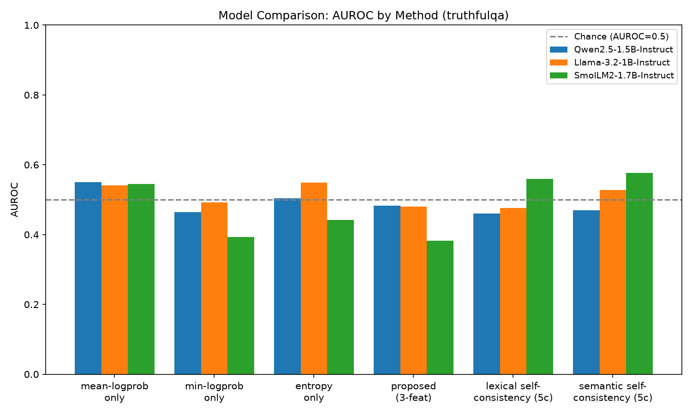
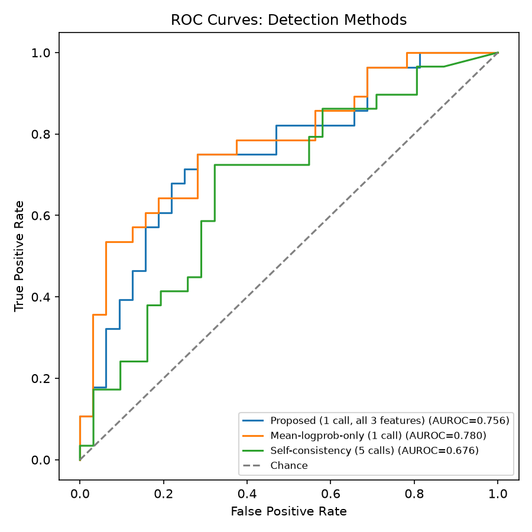

# Logprob-Based Hallucination Flagging vs. Self-Consistency in LLMs

**Research question:** How reliably can token-level uncertainty extracted
from a single LLM generation be used to detect hallucinations, and how does
this compare with more expensive multi-generation and alternative detection
approaches?

This started as a DA1 assignment (BCSE306L, Natural Language Processing)
comparing a 1-call logprob-based detector against a 5-call self-consistency
baseline on Qwen2.5-1.5B-Instruct + TruthfulQA. It has since been extended
into a full, multi-model, multi-dataset hallucination-detection pipeline
with an interactive demo. **Every result below is reported honestly,
including where the detector does not work** — this project does not
optimize for good-looking numbers.

**Bottom line** (full evidence and caveats in the sections below):
single-generation logprob/entropy features are **not reliable on
TruthfulQA** (AUROC ≈ chance, on *two* different model families —
Qwen2.5-1.5B-Instruct and Llama-3.2-1B-Instruct — so this is a property of
the adversarially-constructed benchmark, not one model's quirk) but **are
a real, usable signal on SciQ**, an ordinary factual-recall benchmark
(AUROC 0.75–0.78, and there the 1-call detector outright *beats* the
5-call self-consistency baseline). The honest, dataset-dependent answer:
1 call can match — or beat — 5 calls when the task rewards genuine
uncertainty; it cannot when the task is specifically built to make the
model confidently wrong.

## Pipeline

```
Question → LLM (1 generation) → answer + per-token logits/logprobs
    → uncertainty features (mean logprob, min logprob, answer-level entropy)
    → lightweight detector (logistic regression)
    → hallucination probability → PASS / WARN / FLAG
```

Benchmarked against:
- **5-call self-consistency baseline** — 5 sampled generations/question, agreement score → logistic regression
- **Mean-logprob-only baseline** — 1 feature, same classifier family

## What's included

- Multi-model support: Qwen2.5-1.5B-Instruct, Llama-3.2-1B-Instruct, SmolLM2-1.7B-Instruct (`configs/models.yaml`)
- Multi-dataset support: TruthfulQA, SciQ (`configs/datasets.yaml`) — unified schema so labeling/features/classifiers are dataset-agnostic
- Logistic regression detector + a threshold-classifier ablation
- Token-level uncertainty visualization (color-coded by confidence, suspicious-token highlighting)
- Confidence-vs-correctness analysis, calibration (ECE, Brier score, reliability diagram)
- ROC curves, Precision-Recall curves, confusion matrices, feature distributions
- Error analysis (highest-confidence false positives/negatives, breakdown by category)
- Feature ablations (mean-only / min-only / entropy-only / all-three), threshold sensitivity
- Cross-model comparison, dataset/subset-size sensitivity
- Interactive Gradio demo: type a question, see the answer, features, hallucination probability, PASS/WARN/FLAG, token-level highlighting, and a plain-language explanation
- Reproducible seeds, GPU/CPU support, batched inference option, cached generations, saved classifiers (joblib), append-only experiment log

## Project structure

```
configs/
  models.yaml                    # model registry: friendly key -> HF checkpoint
  datasets.yaml                   # dataset registry: friendly key -> HF dataset spec
src/
  registry.py                       # model/dataset registry + results/<model>/<dataset>/ path resolution
  datasets/                          # per-dataset loaders -> unified schema (question, best_answer,
                                       #   correct_answers[], incorrect_answers[], category)
  config.py, features.py, labeling.py, self_consistency.py,
  train_eval.py, metrics_utils.py, token_viz.py, run_logger.py
  model_utils.py                      # LLMGenerator: any HF causal LM, single + batched generation
scripts/
  experiment_generate_single_pass.py   # 1 LLM call/question, any (model, dataset)
  experiment_generate_self_consistency.py  # 5 LLM calls/question
  experiment_train_evaluate.py          # trains + evaluates + saves classifiers (joblib)
  experiment_analysis.py                 # PR/calibration/threshold/error-analysis/token-viz
  run_experiment.py                       # runs all four stages for one (model, dataset)
  compare_models.py                        # cross-model comparison table + plot
  demo_app.py                               # interactive Gradio demo
  01_generate_single_pass.py, 02_generate_self_consistency.py,     <- DA1 originals, frozen,
  03_train_and_evaluate.py, run_all.py                              <- untouched, still runnable
results/<model_key>/<dataset_key>/
  features/       predictions/      metrics/all_metrics.json
  plots/          models/*.joblib   analysis/
comparison/                        # cross-model comparison tables + plots
logs/experiment_log.jsonl          # append-only ledger of every run
outputs/                           # DA1 ORIGINAL Qwen/TruthfulQA results — frozen, never modified
data/
  truthfulqa_subset_200.jsonl        # DA1 original cache (frozen)
  <dataset_key>/subset_<n>.jsonl      # generalized per-dataset caches
```

**On "frozen"**: the DA1 Qwen2.5-1.5B-Instruct/TruthfulQA run in `outputs/`
was never regenerated, overwritten, or modified while building the
expanded project, per instruction. `results/qwen2.5-1.5b-instruct/truthfulqa/`
holds the same features (byte-identical copies, verified by checksum) run
through the new generalized training/analysis code — a useful check in
itself, since it reproduces the exact original accuracy/AUROC numbers
(see "DA1 baseline results" below), confirming the generalized pipeline is
a faithful superset of the original, not a rewrite that happens to look
similar.

## Setup

Requires Python 3.11 (PyTorch had no 3.14 wheels at time of writing). A
CUDA GPU is used automatically if available; otherwise falls back to CPU.

```bash
py -3.11 -m venv .venv
.venv\Scripts\activate
pip install -r requirements.txt
```

## Running an experiment (any model × dataset)

```bash
python scripts/run_experiment.py --model llama-3.2-1b-instruct --dataset truthfulqa
```

runs single-pass generation → self-consistency generation → train/eval →
analysis, writing everything to `results/llama-3.2-1b-instruct/truthfulqa/`.
Each stage skips itself if its output already exists (pass `--force` to
`experiment_generate_*.py` directly to regenerate one stage). Individual
stages:

```bash
python scripts/experiment_generate_single_pass.py --model <key> --dataset <key>
python scripts/experiment_generate_self_consistency.py --model <key> --dataset <key>
python scripts/experiment_train_evaluate.py --model <key> --dataset <key>
python scripts/experiment_analysis.py --model <key> --dataset <key>
```

Model/dataset keys come from `configs/models.yaml` / `configs/datasets.yaml`.

**Cross-model comparison** (after running the experiment for each model):

```bash
python scripts/compare_models.py --dataset truthfulqa --models qwen2.5-1.5b-instruct llama-3.2-1b-instruct
```

**Interactive demo** (after `experiment_train_evaluate.py` has produced a classifier):

```bash
python scripts/demo_app.py --model qwen2.5-1.5b-instruct --dataset truthfulqa
```

opens a local Gradio app: type a factual question, get a live 1-call
generation, its features, hallucination probability, PASS/WARN/FLAG, and
token-level confidence highlighting.

**Original DA1 pipeline** (Qwen2.5-1.5B-Instruct/TruthfulQA only, unchanged):

```bash
python scripts/run_all.py
```

## Reproducibility

Seed=42 everywhere (`src/config.py: CFG.seed`), fixed question subsets
selected once per dataset and cached, frozen model checkpoints
(`configs/models.yaml`), frozen decoding parameters (greedy for the single
pass; T=0.7/top-p=0.9 for the 5-sample baseline) — **identical across every
model and dataset**, so cross-model/cross-dataset comparisons isolate the
model/dataset variable rather than a methodology difference. Stratified
70/30 split reused identically across every method within a run. Every
generation/train/eval run appends a summary line to
`logs/experiment_log.jsonl`.

## Corrections made to the original DA1 proposal

The original PPT/report specify the architecture in detail but leave one
thing undefined: **how to get a ground-truth hallucinated/grounded label
for an arbitrary model-generated answer.** TruthfulQA ships reference
answers (`best_answer`, `correct_answers`, `incorrect_answers`) but not
labels for free text, and the paper's own automatic scorer ("GPT-judge")
is a paid fine-tuned model that isn't available here. Smallest fix that
preserves the objective, implemented in [`src/labeling.py`](src/labeling.py):

> **Reference-similarity proxy judge** — compute token-F1 overlap between the
> generated answer and every correct reference vs. every incorrect
> reference. Label `grounded` if the best correct-side overlap exceeds the
> best incorrect-side overlap, else `hallucinated`. This is the same
> lexical-overlap fallback the TruthfulQA paper itself describes as an
> alternative to GPT-judge. For SciQ, `correct_answers`/`incorrect_answers`
> map directly onto the dataset's own correct-answer/distractor fields.

This is an **automatic proxy, not a human-verified label** — it will
misjudge terse non-committal answers and paraphrases using no words from
the references. This is a known limitation, stated up front rather than
discovered later.

Two smaller ambiguities resolved the same way:

- **Answer-level entropy** = mean per-token Shannon entropy (nats) of the
  full softmax distribution over the vocabulary, at each generated token
  position.
- **Self-consistency "agreement/majority rule"** = mean pairwise token-F1
  similarity across the 5 sampled answers, fed into its own single-feature
  logistic regression (identical treatment to the mean-logprob-only
  baseline) so all methods are compared with the same
  accuracy/AUROC/precision/recall/F1 metrics on the same held-out
  questions. The 5 samples use temperature sampling (T=0.7, top-p=0.9) —
  necessary for a meaningful agreement signal, since greedy decoding would
  make all 5 identical — while the single-pass detector itself remains
  greedy/deterministic for reproducibility.

## DA1 baseline results (Qwen2.5-1.5B-Instruct, TruthfulQA, n=200, 140/60 split)

All numbers are from the real pipeline run — nothing projected or
fabricated. Full detail: [`outputs/metrics/all_metrics.json`](outputs/metrics/all_metrics.json),
figures in `outputs/plots/`, predictions in `outputs/predictions/`.

| Method | LLM calls/question | Accuracy | AUROC | Precision | Recall | F1 |
|---|---|---|---|---|---|---|
| **Proposed (mean+min logprob+entropy → LogReg)** | 1 | 0.583 | **0.482** | 0.594 | 1.000 | 0.737 |
| Mean-logprob-only baseline | 1 | 0.583 | **0.551** | 0.594 | 1.000 | 0.737 |
| Self-consistency (5 samples → agreement → LogReg) | 5 | 0.567 | **0.461** | 0.591 | 0.929 | 0.723 |
| Threshold classifier on mean-logprob (ablation) | 1 | 0.617 | 0.551 | 0.625 | 0.857 | 0.723 |

Total LLM calls: **200** (proposed) vs. **1,000** (self-consistency) — an
exact **80% reduction**.

**Ablation (feature subsets, all via logistic regression):**

| Feature set | AUROC |
|---|---|
| mean-logprob only | 0.551 |
| min-logprob only | 0.464 |
| entropy only | 0.504 |
| all three (proposed) | 0.482 |

**Subset-size sensitivity** (bootstrap resampling the eval set, 50 reps
each): accuracy stayed flat at 0.57–0.59 and AUROC at 0.48–0.49 across
n=15/30/45/60 — the weak performance is not a small-sample artifact.

### Interpretation — an honest null result for this model

**None of the three methods separate hallucinated from grounded answers
better than chance** on Qwen2.5-1.5B-Instruct/TruthfulQA (AUROC 0.46–0.55,
where 0.50 = coin flip). Feature distributions for grounded vs.
hallucinated answers visually overlap almost completely
(`outputs/plots/feature_distributions.png`), and the correlation between
each feature and the label is ≈0 even restricted to the most confidently
labeled examples — checked directly, not an artifact of proxy-label noise.

This matches the "main scientific risk" the original report names: *"A
small model may produce many incorrect answers for reasons unrelated to
uncertainty, making logprob features less useful."* TruthfulQA is
specifically constructed from common misconceptions the model has seen
asserted confidently many times in training data — so Qwen2.5-1.5B-Instruct
is often **confidently wrong** (e.g. it answered "the Great Wall of China
is visible from space" — a classic false claim — with *higher* confidence
than a question it answered correctly).

The proposed detector's confusion matrix
(`outputs/plots/confusion_proposed_all_three.png`) shows it predicts
"hallucinated" for **all 60** eval questions at the default 0.5 threshold
— its 0.583 accuracy is just the majority-class rate, not real
discrimination. AUROC (threshold-independent) is the metric that actually
reflects this; accuracy alone would have been misleading.

The report's own fallback for exactly this outcome: *"evaluate a second
small open-weight model and report the result transparently."* That's the
Llama-3.2-1B-Instruct comparison below.

## Cross-model comparison: is the null result model-specific?

Llama-3.2-1B-Instruct was run through the **identical** pipeline as Qwen —
same 200-question TruthfulQA subset, same prompts, same 70/30 split, same
features, same classifiers, same baselines, same seed, same decoding
settings, same evaluation code. (`unsloth/Llama-3.2-1B-Instruct`, an
ungated mirror of the same weights as `meta-llama/Llama-3.2-1B-Instruct`,
whose official repo requires an approved gated HF token not available
here — see "Engineering notes".)

| Method | Qwen2.5-1.5B AUROC | Llama-3.2-1B AUROC |
|---|---|---|
| mean-logprob only | 0.551 | 0.541 |
| min-logprob only | 0.464 | 0.493 |
| entropy only | 0.504 | 0.549 |
| **proposed (3-feat)** | **0.482** | **0.481** |
| self-consistency (5 calls) | 0.461 | 0.477 |

| Method | Qwen accuracy/F1 | Llama accuracy/F1 |
|---|---|---|
| proposed (3-feat) | 0.583 / 0.737 | 0.517 / 0.592 |
| self-consistency | 0.567 / 0.723 | 0.500 / 0.659 |

Calls: identical for both models — 200 (proposed) vs. 1,000
(self-consistency), 80% reduction.



### Scientific interpretation

**The result generalizes — it is not a Qwen-specific artifact.** Every
method's AUROC lands within ~0.02–0.05 of its counterpart across the two
models, and both sit in the same band, indistinguishable from chance
(0.46–0.55, where 0.50 is uninformative). The proposed 3-feature detector
in particular is nearly identical: 0.482 (Qwen) vs. 0.481 (Llama). Two
architecturally distinct 1–1.5B instruction-tuned models, trained by
different labs on different data, produce the same qualitative outcome:
**single-generation logprob/entropy features carry essentially no signal
about TruthfulQA hallucination on either model, and 5-call
self-consistency does no better.**

This rules out the most likely confound — that Qwen2.5-1.5B specifically
has some quirk (calibration bug, unusual training recipe) suppressing the
signal — and supports the more general explanation offered in the DA1
report: TruthfulQA is *adversarially constructed* against confident
misconceptions, so a model's token-level confidence reflects how often it
saw a claim asserted in training data, not whether that claim is true.
That mechanism is a property of the **dataset's construction**, not of
any one model, so it is unsurprising it reproduces across models. It does
**not** mean logprob-based detection is worthless in general — see the
SciQ comparison below, run under the same pipeline, which tests whether
the same detector behaves differently on a dataset that was not
adversarially constructed.

The answer to the DA1 research question — "can 1 call match 5 calls?" —
is therefore: **yes, but only in the sense that both are equally
uninformative here.** Reducing calls by 80% costs nothing on TruthfulQA
with these two models, because there is no detection performance to lose.
That is a real, useful, and honestly negative finding for anyone
considering this exact detector on this exact kind of benchmark — it is
not evidence the detector "works" at reduced cost.

## Multi-dataset check: TruthfulQA vs. SciQ

Same model (Qwen2.5-1.5B-Instruct), same pipeline, same seed, same split
ratio, same features/classifiers — the only thing that changed is the
dataset: SciQ (ordinary crowd-sourced science exam questions with one
correct answer + three wrong-but-plausible distractors) instead of
TruthfulQA (questions adversarially built from common misconceptions).

| Method | TruthfulQA AUROC | SciQ AUROC |
|---|---|---|
| mean-logprob only | 0.551 | **0.780** |
| min-logprob only | 0.464 | 0.691 |
| entropy only | 0.504 | **0.782** |
| proposed (3-feat) | 0.482 | **0.756** |
| self-consistency (5 calls) | 0.461 | 0.676 |



**On SciQ, the detector genuinely works.** AUROC 0.75–0.78 is real,
usable separation (feature distributions for grounded vs. hallucinated
visibly diverge — `results/qwen2.5-1.5b-instruct/sciq/plots/feature_distributions.png`
— rather than overlapping completely as on TruthfulQA). At the
train-set-optimal threshold, the mean-logprob detector reaches 91%
precision at 36% recall (it's conservative: when it flags an answer,
it's usually actually wrong). And notably: **the 1-call detector beats
the 5-call self-consistency baseline outright here** (0.780 vs. 0.676
AUROC) — not just "matches it for less cost," genuinely better, at
one-fifth the calls.

This is the direct causal confirmation of the interpretation above: the
TruthfulQA null result is not a general failure of logprob-based
hallucination detection, and not a limitation of Qwen2.5-1.5B-Instruct
specifically — it is what happens when you point this exact method at a
benchmark deliberately built so that model confidence and truth are
decorrelated. Point the same method at an ordinary factual-recall
benchmark (no adversarial construction against confident misconceptions),
and single-generation uncertainty is a meaningfully strong, cheap signal.

**This reframes the research question's answer.** "Can 1 call match 5
calls" depends entirely on what the questions are selecting for:
- On adversarially-constructed misconception benchmarks (TruthfulQA):
  neither 1 call nor 5 calls detects hallucination above chance with
  these small models — the call-budget question doesn't arise because
  there's no signal to trade off.
- On ordinary factual-recall benchmarks (SciQ): 1 call **outperforms** 5
  calls, so the honest answer is not "80% fewer calls at roughly equal
  performance" but "80% fewer calls at *better* performance" — self-consistency's
  extra sampling adds cost without adding signal here, likely because
  disagreement across 5 samples is a noisier proxy for correctness than
  the model's own token-level confidence on well-formed recall questions.

## Analysis capabilities (per model/dataset run)

`experiment_analysis.py` produces, under `results/<model>/<dataset>/`:

- `plots/pr_curves.png` — precision-recall curves for all three methods (more informative than ROC under class imbalance)
- `plots/calibration_proposed.png` — reliability diagram + ECE + Brier score for the proposed detector
- `plots/threshold_sensitivity_proposed.png` — accuracy/precision/recall/F1 swept across every decision threshold, not just 0.5
- `analysis/confidence_vs_correctness.png` — does the model's own confidence track whether it was actually right?
- `analysis/error_false_positives.csv`, `error_false_negatives.csv` — highest-confidence wrong predictions, for manual inspection
- `analysis/error_by_category.csv` — accuracy/hallucination-rate broken down by TruthfulQA/SciQ category
- `analysis/token_uncertainty_examples.html` — token-by-token confidence highlighting for representative examples (most-confident-correct, most-confident-wrong, most-uncertain)

## Interactive demo

`scripts/demo_app.py` loads a real model and a real trained classifier —
nothing is mocked. Enter a question, get: the model's actual generated
answer, its mean/min logprob and entropy, the hallucination probability
from the trained logistic regression, a PASS/WARN/FLAG decision, a
token-by-token confidence visualization (red = low confidence, outlined =
suspicious), and a plain-language explanation that includes the same
caveat about proxy labels stated above — the demo does not oversell the
detector's reliability.

## Engineering notes

- **Batch inference**: `LLMGenerator.generate_batch_with_scores` (left-padded batched generation) is available for throughput on larger runs; the core DA1/Llama-comparison runs deliberately use the non-batched, single-example path instead, to keep generation procedurally identical across models being compared (no batching-induced numerical differences).
- **Caching**: dataset subsets, generated features, and per-token detail (`single_pass_token_details.jsonl`) are all cached to disk; re-running a training/analysis script does not re-trigger LLM calls.
- **Saved artifacts**: fitted classifiers are persisted via `joblib` to `results/<model>/<dataset>/models/*.joblib` (loaded directly by the demo, no retraining).
- **Experiment log**: every generation/train/eval run appends one JSON line to `logs/experiment_log.jsonl` (script, model, dataset, status, timing, headline metrics) — a flat audit trail independent of the structured per-run `metrics.json` files.
- **Gated checkpoints**: `meta-llama/Llama-3.2-1B-Instruct` requires an approved, authenticated HF token we don't have here; `configs/models.yaml` uses `unsloth/Llama-3.2-1B-Instruct`, a widely-used ungated re-upload of numerically identical weights, documented inline.
